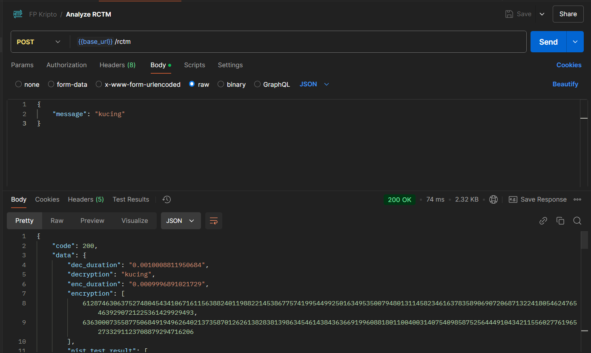
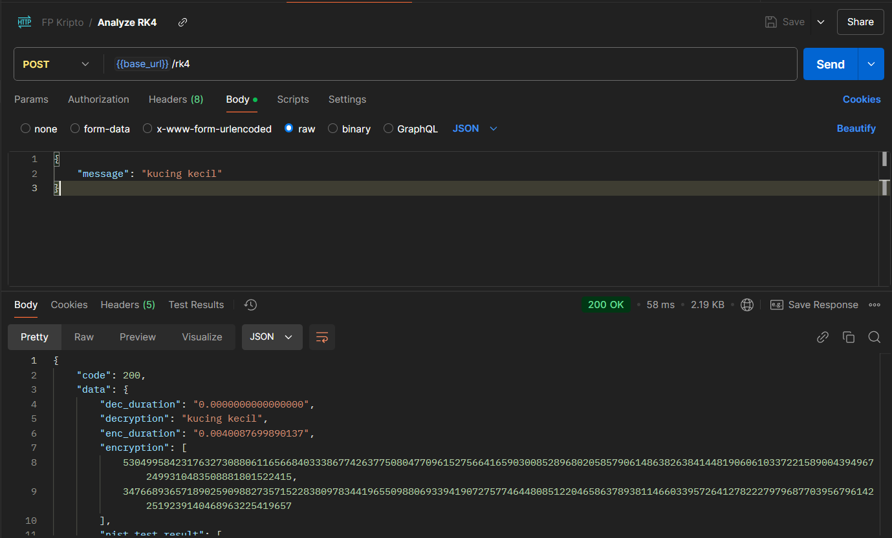
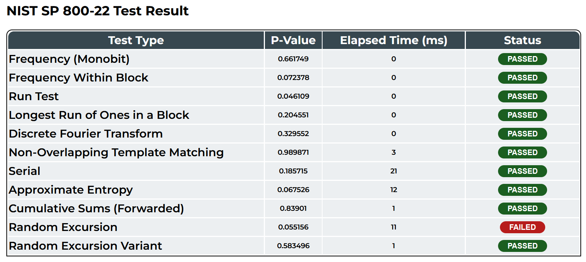

# FP Kriptografi - Kelas A

## Kelompok 7:

- **Dwiyasa Nakula** (5027221001)

- **Muhammad Afif** (5027221032)

## Pendahuluan

Final Project Kriptografi dilakukan dengan mengimplementasikan dua algoritma CSPRNG (Cryptographically Secure Pseudorandom Number Generator) pada sebuah algoritma kriptografi tertentu. Kedua algoritma harus dapat diakses melalui sebuah UI. Kemudian, kedua algoritma CSPRNG dilakukan analisis untuk mengetahui efisiensi dan tingkat keamanannya.

Di sini kelompok 7 mengimplementasikan dua CSPRNG berbasis Chaos menggunakan metode `Robust Chaotic Tent Map (RCTM)` dan `Artificial Neural Networks (ANN)`. dua CSPRNG tersebut nantinya akan diimplementasikan untuk melakukan kegiatan enkripsi dan dekripsi pada algoritma `El-Gamal`.

Adapun Paper rujukan dari kedua CSPRNG sebagai berikut:

1. [Cryptographically Secure Pseudo-Random Number Generation (CS-PRNG) Design using Robust Chaotic Tent Map (RCTM)](https://arxiv.org/abs/2408.05580)

2. [Pseudo Random Number Generator Based on Chaos Theory and Artificial Neural Networks](https://www.researchgate.net/publication/365930031_Pseudo_Random_Number_Generator_Based_on_Chaos_Theory_and_Artificial_Neural_Networks)

## Penjelasan Repository

Repository ini terdiri atas dua bagian, yaitu `FE` dan `BE`.

- `FE` merupakan workspace Front-End yang berfungsi untuk menampilkan UI Website berbasis `NextJS`.

- `BE` merupakan workspace Back-End yang berfungsi untuk menjalankan kedua algoritma CSPRNG, enkripsi dan dekripsi El-Gamal, serta analisis CSPRNG. BE berbasis `python`.

### Cara Mengoperasikan BE

1. Buat sebuah virtual environment python bernama `kripto-env`
```bash
py -3.9 -m venv kripto-env
```

2. Aktifkan virtual environment
```bash
# Pada Windows
./kripto-env/Script/activate

# Pada Linux
source kripto-env/bin/activate
```

3. Instal segala dependensi
```bash
pip install -r requirement.txt
```

4. Jalankan Server
```bash
py main.py
```

5. Secara default, server akan berjalan pada `localhost:4000`.

#### Analisis RCTM



`Request Body`
```json
{
    "message": "kucing"
}
```

`Response`
```json
{
    "code": 200,
    "data": {
        "dec_duration": "0.0010008811950684",
        "decryption": "kucing",
        "enc_duration": "0.0009996891021729",
        "encryption": [
            6128746306375274804543410671611563882401198822145386775741995449925016349535007948013114582346163783589069072068713224180546247654639290721225361429929493,
            6363000735587750684919496264021373587012626138283813986345461438436366919960881801100400314075409858752564449104342115560277619652733291123708879294716206
        ],
        "nist_test_result": [
            {
                "elapsed_time": 0,
                "name": "Monobit",
                "score": 0.6617487760817584,
                "status": "PASSED"
            },
            {
                "elapsed_time": 1,
                "name": "Frequency Within Block",
                "score": 0.0723775521925407,
                "status": "PASSED"
            },
            {
                "elapsed_time": 0,
                "name": "Runs",
                "score": 0.04610930344828874,
                "status": "PASSED"
            },
            {
                "elapsed_time": 0,
                "name": "Longest Run Ones In A Block",
                "score": 0.20455128884969603,
                "status": "PASSED"
            },
            {
                "elapsed_time": 0,
                "name": "Discrete Fourier Transform",
                "score": 0.32955189239856303,
                "status": "PASSED"
            },
            {
                "elapsed_time": 2,
                "name": "Non Overlapping Template Matching",
                "score": 0.9898712734141555,
                "status": "PASSED"
            },
            {
                "elapsed_time": 17,
                "name": "Serial",
                "score": 0.18571547354244694,
                "status": "PASSED"
            },
            {
                "elapsed_time": 11,
                "name": "Approximate Entropy",
                "score": 0.067525729312074,
                "status": "PASSED"
            },
            {
                "elapsed_time": 1,
                "name": "Cumulative Sums",
                "score": 0.8390098918399107,
                "status": "PASSED"
            },
            {
                "elapsed_time": 10,
                "name": "Random Excursion",
                "score": 0.05515616197465392,
                "status": "FAILED"
            },
            {
                "elapsed_time": 0,
                "name": "Random Excursion Variant",
                "score": 0.5834957894232291,
                "status": "PASSED"
            }
        ],
        "original": "kucing"
    },
    "message": "RCTM successfully analyzed",
    "status": true
}
```

#### Analisis ANN



`Request Body`
```json
{
    "message": "kucing kecil"
}
```

`Response`
```json
{
    "code": 200,
    "data": {
        "dec_duration": "0.0000000000000000",
        "decryption": "kucing kecil",
        "enc_duration": "0.0040087699890137",
        "encryption": [
            5304995842317632730880611656684033386774263775080477096152756641659030085289680205857906148638263841448190606103372215890043949672499310483508881801522415,
            3476689365718902590988273571522838097834419655098806933941907275774644808512204658637893811466033957264127822279796877039567961422519239140468963225419657
        ],
        "nist_test_result": [
            {
                "elapsed_time": 0,
                "name": "Monobit",
                "score": 0.189,
                "status": "PASSED"
            },
            {
                "elapsed_time": 0,
                "name": "Frequency Within Block",
                "score": 0.168,
                "status": "PASSED"
            },
            {
                "elapsed_time": 0,
                "name": "Runs",
                "score": 0.012,
                "status": "PASSED"
            },
            {
                "elapsed_time": 1,
                "name": "Longest Run Ones In A Block",
                "score": 0.138,
                "status": "PASSED"
            },
            {
                "elapsed_time": 0,
                "name": "Discrete Fourier Transform",
                "score": 0.688,
                "status": "PASSED"
            },
            {
                "elapsed_time": 1,
                "name": "Non Overlapping Template Matching",
                "score": 0.999,
                "status": "PASSED"
            },
            {
                "elapsed_time": 18,
                "name": "Serial",
                "score": 0.16,
                "status": "PASSED"
            },
            {
                "elapsed_time": 10,
                "name": "Approximate Entropy",
                "score": 0.067,
                "status": "PASSED"
            },
            {
                "elapsed_time": 1,
                "name": "Cumulative Sums",
                "score": 0.239,
                "status": "PASSED"
            },
            {
                "elapsed_time": 5,
                "name": "Random Excursion",
                "score": 0.155,
                "status": "FAILED"
            },
            {
                "elapsed_time": 0,
                "name": "Random Excursion Variant",
                "score": 0.374,
                "status": "FAILED"
            }
        ],
        "original": "kucing kecil"
    },
    "message": "RK4 successfully analyzed",
    "status": true
}
```

### Cara Mengoperasikan FE

1. Salin isi dari `.env.example` pada `.env`

2. Instal segala dependensi
```bash
pnpm i
```

3. Jalankan Front-End menggunakan `pnpm dev`
```bash
pnpm dev
```

4. Secara Default, Front-End akan berjalan pada `localhost:3000`

`Contoh Hasil Analisis`

